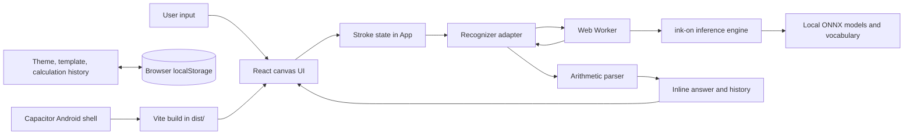

# CalcInk Architecture

## 1. Purpose and scope

CalcInk is a client-side handwriting calculator. A user writes arithmetic on a canvas; the app recognizes the strokes locally, evaluates the recognized expression, and projects a result beside the writing. The same Vite web application is packaged for Android through Capacitor.

This document describes the implementation in this repository. A hosted browser build needs a network for its first visit. Its generated service worker then precaches the production page, scripts, fonts, model files, and ONNX WebAssembly runtime; after that cache setup completes, the app and recognition can run offline. Capacitor packages the same assets inside the Android app and skips the redundant browser cache.

## 2. System context



The app has no application server or remote calculation service. The Android project hosts the same web build through Capacitor. Vite supplies development and production web builds.

## 3. Runtime components

| Component | Responsibility |
| --- | --- |
| `src/main.tsx` | React entry point; loads local font packages and global styles, then mounts `App`. |
| `src/App.tsx` | Owns UI state, canvas lifecycle, stroke editing, undo/redo, debounced recognition, result projection, and settings/history persistence. |
| `src/App.css`, `src/index.css` | Component and global presentation. Fonts are bundled from Fontsource packages. |
| `src/canvasCoordinates.ts` | Converts viewport pointer coordinates to canvas-relative CSS-pixel coordinates. |
| `src/strokePipeline.ts` | Adapts editable canvas strokes to the model stroke contract, removes erasers, checks meaningful ink, and invokes preprocessing to build the tensor and mask. |
| `src/recognizer.ts` | Manages the reusable worker and request IDs, sends stroke snapshots, normalizes recognized LaTeX, and invokes evaluation. |
| `src/recognizer.worker.ts` | Loads the local vocabulary and ONNX engine, preprocesses strokes into tensors, performs inference off the UI thread, and returns recognition results. |
| `src/arithmetic.ts` | Parses and evaluates the supported arithmetic grammar without dynamic code execution. |
| `src/FpsIndicator.tsx` | Displays a bounded rolling frame-rate sample and cancels its animation frame on unmount. |
| `public/models/` | Contains the encoder, decoder, and vocabulary fetched by same-origin paths at runtime. Vite copies these assets to the production output. |
| `android/`, `capacitor.config.json` | Capacitor Android wrapper configuration and native project. `webDir` is `dist`. |
| `src/*.test.ts`, `src/*.test.ts` | Vitest coverage for recognition/math pipeline behavior and canvas coordinate conversion. |

## 4. Drawing and canvas model

The HTML canvas is the visible drawing surface. React keeps the editable stroke model in refs so pointer movement does not trigger a component render for every point. Each stroke stores CSS-pixel points, width, color, and a style (`pen`, `calligraphy`, or `eraser`). The canvas renderer replays this model when the surface needs redraw, including after resize and undo/redo.

Pointer coordinates are converted from viewport coordinates by subtracting the canvas rectangle's `left` and `top`. This keeps stored points independent of the canvas's physical backing-store resolution.

Canvas setup multiplies CSS dimensions by a resolution ratio based on device pixel ratio and the dynamic-resolution setting. The requested dynamic ratio scales linearly from 2× to 10× across the brush-width range, multiplied by the display DPR. A 12-million-pixel budget can cap the effective ratio. Resize and display-resolution changes recreate the backing store and redraw the retained strokes.

### Drawing-history bounds

Undo/redo snapshots are in-memory only. To keep long sessions bounded, the app retains at most 20 snapshots, 500 strokes, and 20,000 points in the current canvas model. When limits are exceeded it drops older strokes; a single overlong stroke is downsampled while preserving its endpoints. Calculation history is separate, capped at 10 entries, and persisted locally.

## 5. Recognition and answer flow

```mermaid
sequenceDiagram
  participant U as User
  participant A as App / canvas
  participant R as Recognizer adapter
  participant W as Recognition worker
  participant M as Local model files
  participant P as Arithmetic parser

  U->>A: Finish a stroke or erase ink
  A->>A: Save bounded undo snapshot; increment canvas revision
  A->>A: Wait 650 ms after the last edit
  A->>R: Send a snapshot of current strokes
  R->>W: Send strokes with request ID
  W->>W: Exclude eraser strokes; validate meaningful ink
  W->>W: Render strokes, resample, scale, and build grayscale tensor plus mask
  W->>M: Initialize model and vocabulary once
  W->>W: Recognize arithmetic in the worker
  W-->>R: Return recognized LaTeX and timing
  R->>R: Normalize supported operators
  R->>P: Evaluate the left side when an equals sign exists
  P-->>R: Return a formatted value or no valid result
  R-->>A: Return expression, answer, and recognition metadata
  A->>A: Ignore result if canvas revision changed
  A->>U: Render inline answer; invalid equation displays red "undefined"
```

Recognition can also be triggered immediately from the toolbar. The app lazily creates one module worker and associates requests with monotonically increasing IDs. The worker initializes the ONNX engine and vocabulary through cached promises so subsequent requests reuse them. Canvas strokes are structured-cloned to the worker, where both preprocessing and inference run; no tensor rendering work blocks pointer handling. A failed worker rejects pending requests, clears the request map, and can be recreated on the next request.

The app waits 650 ms after the last edit before starting live recognition. A recognition response is applied only if it belongs to the current canvas revision; this prevents slow inference on old strokes from overwriting a newer drawing. If an edit arrives during inference, a follow-up recognition is queued. The displayed duration includes preprocessing, cold model initialization, and inference.

### Canvas-to-tensor contract

`src/strokePipeline.ts` is the boundary between UI geometry and model input. It drops eraser records, maps each remaining canvas stroke's CSS-pixel `points` and `width` to `ink-on`'s `points` and `lineWidth`, and rejects ink that does not meet the recognizer's meaningful-stroke check. It then delegates image preparation to `ink-on/core`'s `preprocessStrokes`.

That preprocessing runs in the recognition worker. It renders strokes into a cropped image, rescales it to model dimensions, converts pixels to a `Float32Array` grayscale tensor, and creates a `Uint8Array` padding mask. The resulting `PreprocessResult` carries tensor, mask, height, width, and mask dimensions. `src/recognizer.ts` sends a structured-clone stroke snapshot to the worker; the tensor never needs to be built or copied on the UI thread. The coordinates remain CSS pixels throughout capture; device-pixel-ratio canvas scaling affects only the display backing store.

## 6. Arithmetic evaluation

`evaluateCalculatorInput` is a small recursive-descent parser. It does not call `eval`, `Function`, or another dynamic-code facility.

| Syntax | Behavior |
| --- | --- |
| Decimal numbers | Digits with an optional fractional part, such as `12.5`. |
| Unary signs | Prefix `+` and `-`. |
| Addition and subtraction | Lower precedence than multiplication and division; evaluated left-to-right. |
| Multiplication and division | `×`, `÷`, `*`, and `/` after normalization; evaluated left-to-right. |
| Parentheses | Nested arithmetic groups. |
| Implicit multiplication | Adjacent number/group forms such as `2(3+4)` and `(2)(3)`. |
| Equals sign | The parser evaluates the expression to its left; the handwritten right-hand side is not used as a constraint. |

Malformed tokens, unmatched parentheses, non-finite results, and division by zero produce no numeric value. When an equals sign is present, the UI represents that outcome as the literal `undefined` in red. The parser rounds finite output through 12 significant digits before rendering.

## 7. Persistence and offline behavior

The browser's `localStorage` stores the selected theme, canvas template, and up to 10 recent calculation-history entries. Canvas strokes and undo/redo snapshots are session state and are not persisted. Storage reads are validated and guarded so unavailable or malformed storage does not prevent the current session from running.

Vite dev and preview servers send `Cross-Origin-Opener-Policy: same-origin` and `Cross-Origin-Embedder-Policy: require-corp` so ONNX Runtime Web can use multiple WASM threads when the browser supports cross-origin isolation. The worker caps the pool at four threads (or half the reported logical cores) to avoid oversubscribing the device. Static production hosts need to send equivalent headers to enable this optimization; without them, recognition still works with single-thread WASM. The beam width remains 4, so this speed path does not reduce the model's search width.

Recognition models, vocabulary, WASM runtime, and fonts are packaged as local project/build assets. Recognition itself does not require an external API. A Vite production-build plugin writes a versioned service worker that precaches every file in `dist`, including lazy-loaded worker chunks and public model files. Same-origin requests use that cache offline, and offline navigations fall back to the cached app shell. The service worker is registered only in production browser builds over a supported secure context; Capacitor packaging already includes the Vite output in the native app and skips service-worker caching.

## 8. Build, test, and packaging

```text
npm run dev          # Vite development server
npm run test         # Run Vitest once
npm run build        # TypeScript project build, then Vite production build
  npm run preview      # Serve the production build locally
npm run android:sync # Build web assets and sync them into the Capacitor Android project
npm run android:apk  # Sync, then assemble a debug Android APK
```

The parser tests cover arithmetic precedence, signs, parentheses, implicit multiplication, decimal forms, malformed input, division by zero, and overflow. Coordinate tests verify canvas offsets and fractional CSS-pixel coordinates. Stroke-pipeline tests cover coordinate/width mapping, eraser exclusion, meaningful-ink validation, and the tensor preparation contract. The production build runs TypeScript project checks before bundling and generates the offline asset cache.

## 9. Key invariants and extension points

- Canvas stroke points remain in CSS pixels; only the canvas backing store uses device pixels.
- Eraser geometry affects the editable stroke list and is not sent to the handwriting model as ink.
- Recognition responses are applied only to the revision that generated them.
- The model and vocabulary paths in the worker must continue to resolve under both Vite hosting and the Capacitor `dist` packaging flow.
- Keep all runtime dependencies same-origin and ensure the production precache includes the full build output so airplane-mode recognition has its worker, models, and WASM runtime available.
- Extend arithmetic by changing the tokenizer/parser and adding tests; do not evaluate recognized text as JavaScript.
- Extend persistence deliberately: validate loaded data, define a size bound, and handle unavailable local storage.
